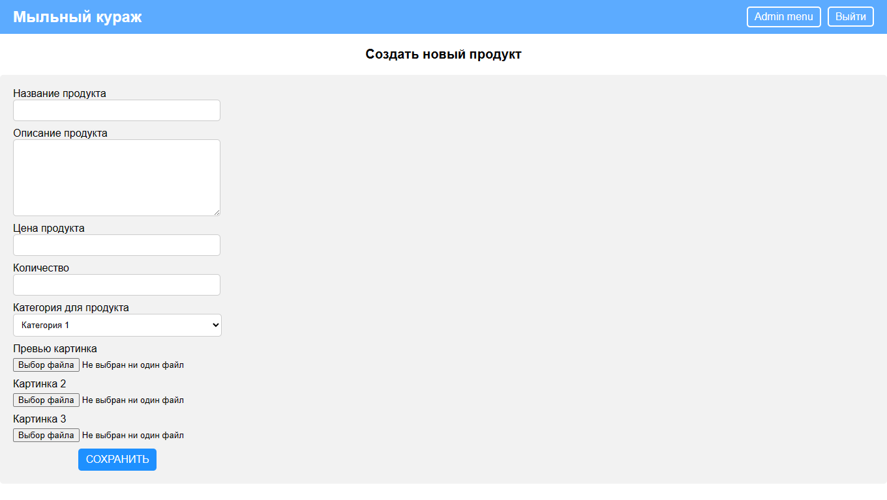

# Pet проект WebStore
## Технологии:
* Spring(Boot, Data, Security)
* JPA / Hibernate
* PostgreSQL
* Thymeleaf
* Maven
* Junit, Mockito
* Lombok
* HTML,CSS
## О проекте:
* Пользователи могут регистрироваться и логиниться
* Незарегестрированные пользователи могут направляться по главной странице,по странице продукта, а также зарегестрироваться или же залогиниться
* Зарегистрированные пользователи могут направляться также по странице корзины,по странице заказов
* Пользователи могут найти продукт по категориям или точному названию
* Пользователи могут добавлять продукты в корзину,изменять их количество в корзине,удалить продукт из корзины или же очистить корзину полностью
* Пользователи могут заказать действующую корзину, а также могут просматривать статус заказа и рание заказы
* Пользователи могут также поменять данные и место доставки
* Админ может добавлять продукты с 3 картинками,также добавлять новые категории
* Админ может банить и разбанивать пользователей
* Админ может смотреть заказы и менять их статус

## Основные скриншоты:

Каталог      |  Страница продукта
:------------------------:|:-------------------------:
 |  

Корзина |  Добавление нового продукта
:------------------------:|:-------------------------:
 |  
